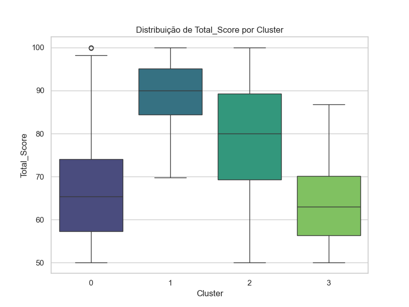
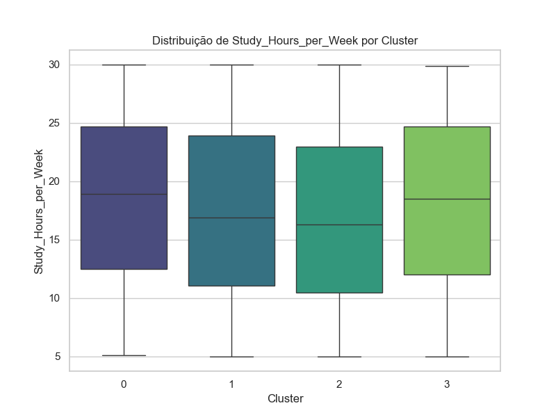
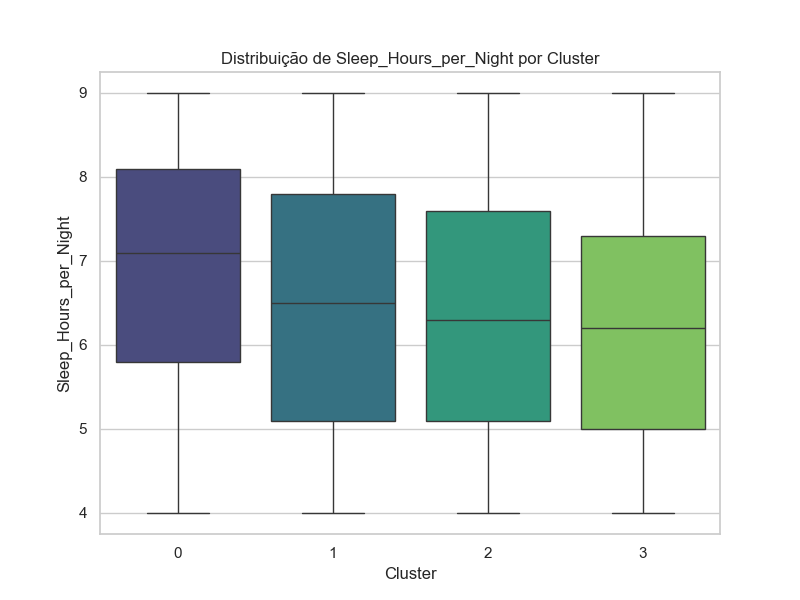

# Student Performance Clustering 🚀

Esse projeto tem como objetivo agrupar estudantes com base em seus comportamentos e desempenho acadêmico, usando técnicas de **Machine Learning** (K-Means Clustering).

## 📁 Estrutura do Projeto

📂 student-performance-clustering  
|-- 📂 data                          # Dados brutos e processados  
|   |-- Students_Grading_Dataset.csv  
|   |-- clustering_data_scaled.npy  
|   |-- students_with_clusters.csv  
|-- 📂 notebooks                     # Análises exploratórias e relatórios  
|   |-- exploratory_analysis.ipynb  
|   |-- cluster_analysis.ipynb  
|   |-- cluster_visuals.ipynb  
|-- 📂 scripts                       # Código estruturado  
|   |-- data_preprocessing.py  
|   |-- clustering_model.py  
|   |-- train_clustering.py  
|-- 📂 visuals                       # Gráficos gerados  
|   |-- Total_Score_by_cluster.png  
|   |-- Attendance (%)_by_cluster.png  
|   |-- Study_Hours_per_Week_by_cluster.png  
|   |-- Stress_Level (1-10)_by_cluster.png  
|   |-- Sleep_Hours_per_Night_by_cluster.png  

## 🧑‍💻 Como Rodar o Projeto

1. Clone o repositório:
```bash
git clone https://github.com/digalugas/Student-Performance-And-Behavio.git
cd Student Performance And Behavior
```
2. Crie e ative um ambiente virtual (opcional, mas recomendado):
```bash
# No Windows
python -m venv venv
venv\\Scripts\\activate

# No Mac/Linux
python3 -m venv venv
source venv/bin/activate
```
3. Instale as bibliotecas necessárias:
```bash
pip install -r requirements.txt
```
4. Execute os scripts:
```bash
python scripts/data_preprocessing.py
python scripts/train_clustering.py
```
5. Explore as Análises:
* Abra os notebooks 
*  Visualize os gráficos

## 🔍Insights
* Estudantes com maior frequência e horas de estudo tendem a ter notas mais altas.
* Grupos com nível de estresse mais alto têm variação nas notas — alguns lidam bem, outros não.
* A qualidade do sono também influencia diretamente o desempenho acadêmico.

## 📊 Visualizações
Exemplos de gráficos gerados:
Aqui estão algumas das visualizações geradas a partir da análise dos clusters:

- **Distribuição de Notas por Cluster**  
  Representa a variação das notas totais entre os diferentes grupos de estudantes.  
    

- **Frequência (%) por Cluster**  
  Mostra a média de frequência de cada cluster de estudantes.  
  _by_cluster.png)  

- **Horas de Estudo por Semana por Cluster**  
  Compara o tempo médio de estudo semanal entre os grupos.  
    

- **Nível de Estresse por Cluster**  
  Demonstra a relação entre estresse e comportamento acadêmico em cada cluster.  
  _by_cluster.png)  

- **Horas de Sono por Noite por Cluster**  
  Analisa como a quantidade de sono varia entre os clusters.  
  
## 🛠️Técnologias Utilizadas
* Python
* Pandas
* NumPy
* Scikit-learn
* Seaborn
* Matplotlib


💻 Feito com 💙 por [DigaLugas](github.com/DigaLugas)